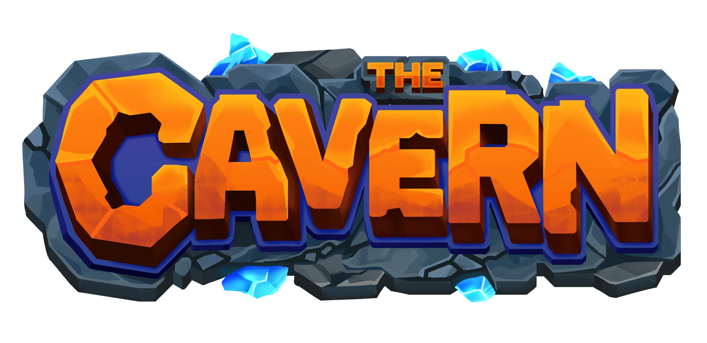

# The Cavern Wiki

</img>
</img>
</img>

</img>

  
  

Welcome to the official Cavern Wiki!

TheCavern is a family-friendly, survival multiplayer (SMP) Minecraft server compatible with both Bedrock and Java edition. In this immersive world, you can explore dungeons, engage with a dynamic towny system, and participate in a thriving player-based economy. Enhanced by a suite of plugins, including slimefun, pyrofishing, pyromining, and MoFood, TheCavern offers a unique twist on traditional gameplay.

At its core, TheCavern fosters a wholesome and welcoming community. With a donation model in place, the server remains balanced and non-competitive, allowing the focus to stay on fun, exploration, and creative collaboration. Join TheCavern and become a part of our vibrant, supportive community where anyone can forge their own epic journey!

:::note

This wiki is new, check out the [Contributing](/Contributing) page to help out!

If you want to see upcoming wiki updates, go to the [dev wiki](https://wiki-next.thecavern.net).

:::
