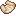

# Cavern Items

## Builder's Wand

The builders wand is a special item that allows the user to build out platforms and patterns of blocks and cut down time on building.
The wand produces a preview of glowing blocks that when the wand is right-clicked will place the blocks and remove them from your inventory.

Unlike the original builders wand, these have a max durability. 1 use of the wand takes 1 durability, and follows a similar damage formula when unbreaking is applied to the item.

### Known Limitations

The following blocks are banned from being used with the wand

* Chests
* Trapped Chests
* Doors
* Shulker Boxes
* Skulls
* All Slimefun blocks
* All MoFood™ blocks

### Wand Limits per level

#### Base Wand

* Glass block outline
* White glow
* 32 Block limit
* 100 Base durability

#### Tier 2 Wand

* Glass block outline
* Selectable color glow
* 64 Block limit
* 500 Base durability

#### Tier 3 Wand

* Custom block outline
* Custom hex color glow
* 160 Block limit
* 1000 Base durability

### Obtaining

#### Tier 1

The base builders wand is obtained via crafting using diverse items obtained from around various dimensions.

You must obtain a copy of the scroll: *The Beginning of Creativity*

You can find this item by venturing out and looting bastions and blacksmiths' chest within villages.

The loot rate for bastions is ~35%, and blacksmith chests are 100%.

<table>
    <tr>
        <td></td>
        <td></td>
        <td></td>
    </tr>
    <tr>
        <td></td>
        <td></td>
        <td></td>
    </tr>
    <tr>
        <td></td>
        <td></td>
        <td></td>
    </tr>
</table>

### F.A.Q

> What about the old wand that people purchased from admin shop?

*When that wand is Shift+Right Clicked, it will auto convert to a new Level 2 Unbreaking V builders wand.*

> Where is the information about the other wands?

*We'd like people to explore the information available to them with the wands and let earlier hunters figure it out before we publish all the information.*

> Is it supposed to be a stick?

*We're waiting for the model to be fully complete.* **#JustDragonThings**
